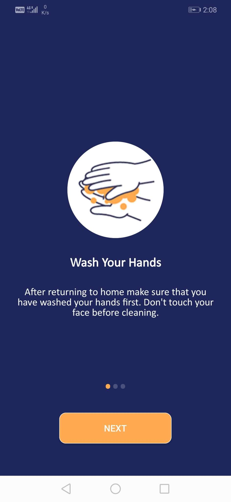
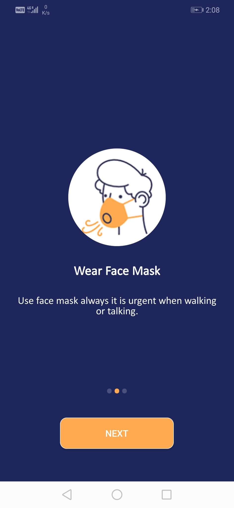
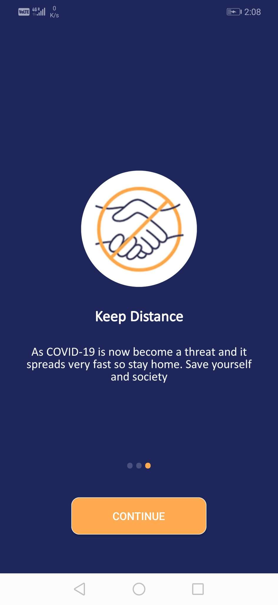
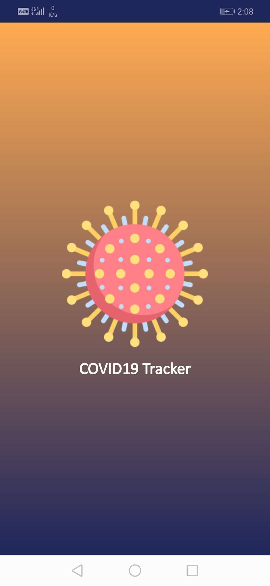
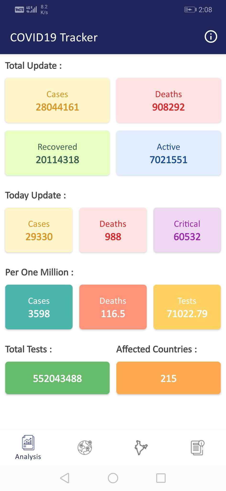
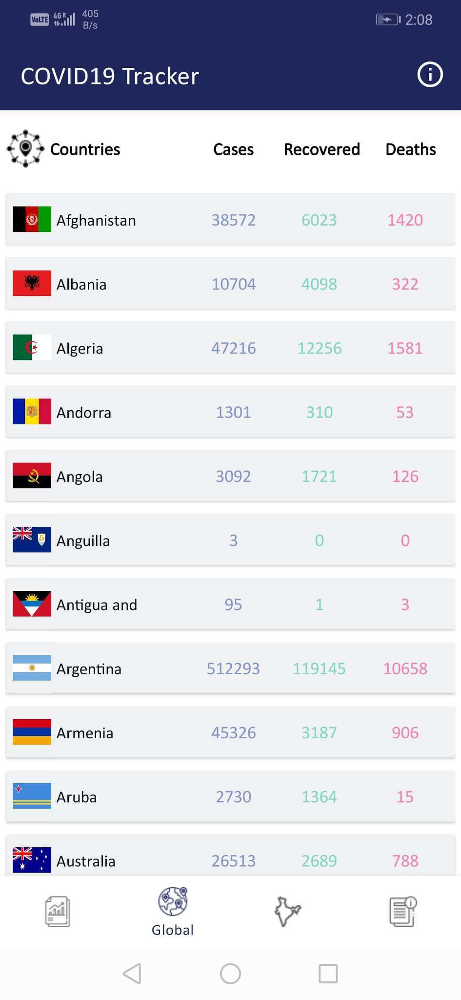
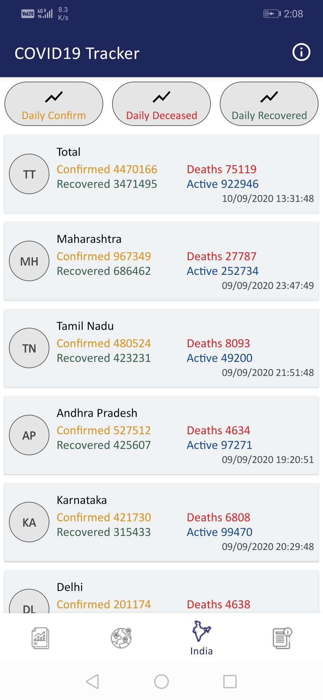
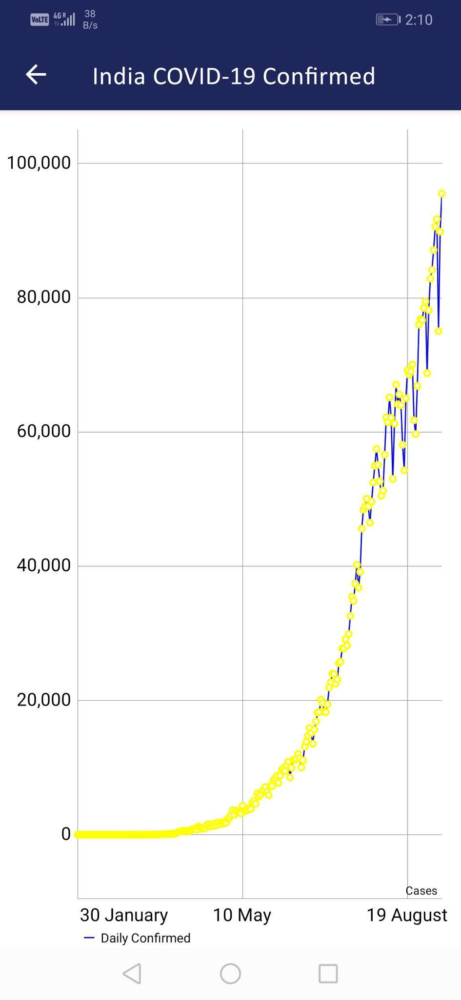
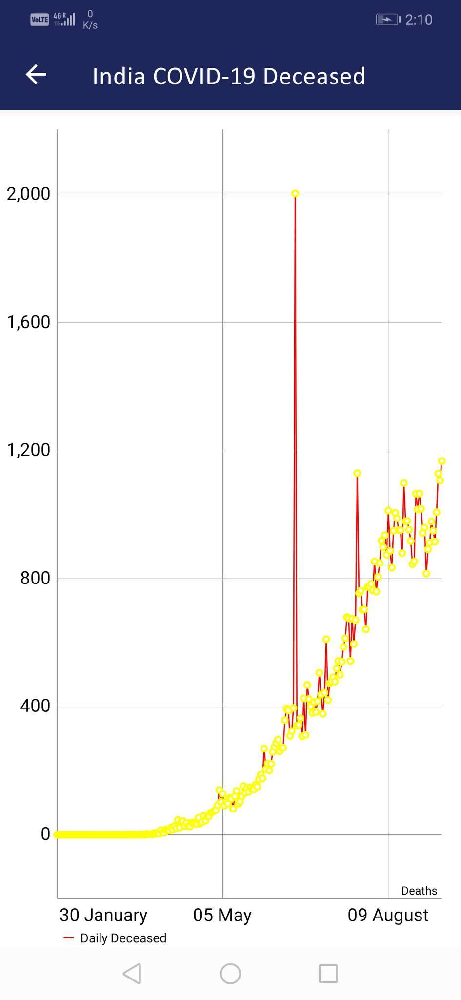
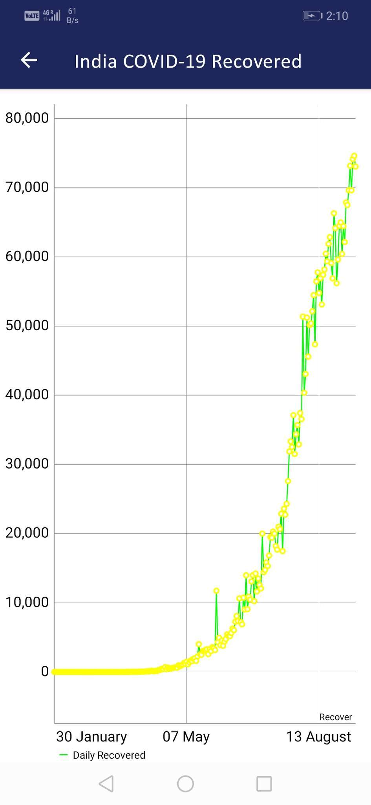

# T-COVID19
The T-COVID19 is an Android application that provides the latest information and updates about the Corona Virus(COVID-19) from all corona affected countries of the world and India. In India, we also show live data with different states, union territories, and capitals. It also gives a set of basic COVID-19 symptoms and precautions. Here we have listed the cases as new and old with recovery, deaths, and total with date-time of data updates. 

For India, you can also track the daily cases, recovered, and deaths on a graph with the date and count. 

<h1>Built With</h1>
<ul>
<li><a href="https://kotlinlang.org/">Kotlin</a> - Official programming language for Android application development by Google.</li>
<li><a href="https://github.com/google/volley">Volley</a> - An HTTP library that makes networking for Android apps easier and, most importantly, faster.</li>
<li><a href="https://square.github.io/picasso/">Picasso</a> - A powerful image downloading and caching library for Android.</li>
<li><a href="https://material.io/components">Material Components</a> - The material UI components for Android, designed and developed by Google.</li>
<li><a href="https://firebase.google.com/">Firebase</a> - For crash reporting, analytics, and cloud messaging.</li>
</ul>

<h1>Thanks To</h1>
<ul>
<li><a href="https://github.com/CSSEGISandData/COVID-19">JHU CSSE</a> - Johns Hopkins University Center for Systems Science and Engineering.</li>
<li><a href="https://api.covid19india.org/">COVID19India.org</a> - Official managed by indian govt.</li>
<li><a href="http://www.nsakcet.ac.in/">NSAKCET</a> - Nawab Shah Alam Khan College of Engineering and Technology.</li>
</ul>

<table>
  <tr>
    <td>Intro Screen</td>
    <td>Intro Screen</td>
    <td>Intro Screen</td>
    <td>Splash Screen</td>
  </tr>
  <tr>
    <td></td>
    <td></td>
    <td></td>
    <td></td>
  </tr>
  <tr>
    <td>Analysis Screen</td>
    <td>Global Screen</td>
    <td>India Screen</td>
    <td>Confirmed Screen</td>
  </tr>
  <tr>
    <td></td>
    <td></td>
    <td></td>
    <td></td>
  </tr>
  <tr>
    <td>Deceased Screen</td>
    <td>Recovered Screen</td>
    <td>Info Screen</td>
  </tr>
  <tr>
    <td></td>
    <td></td>
    <td></td>
  </tr>
</table>
